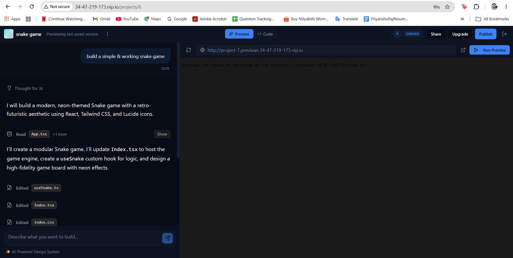
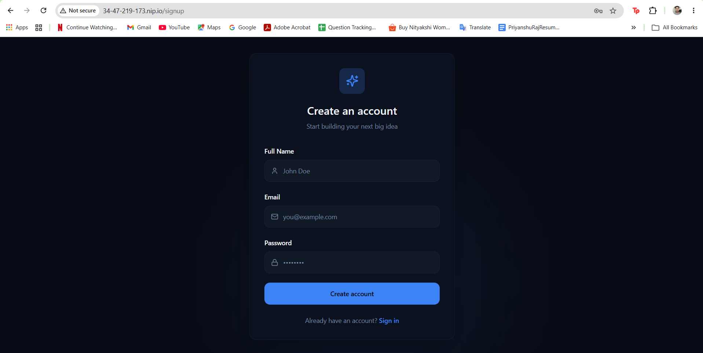
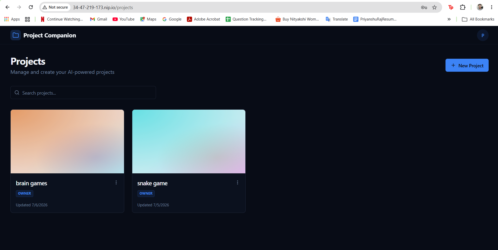
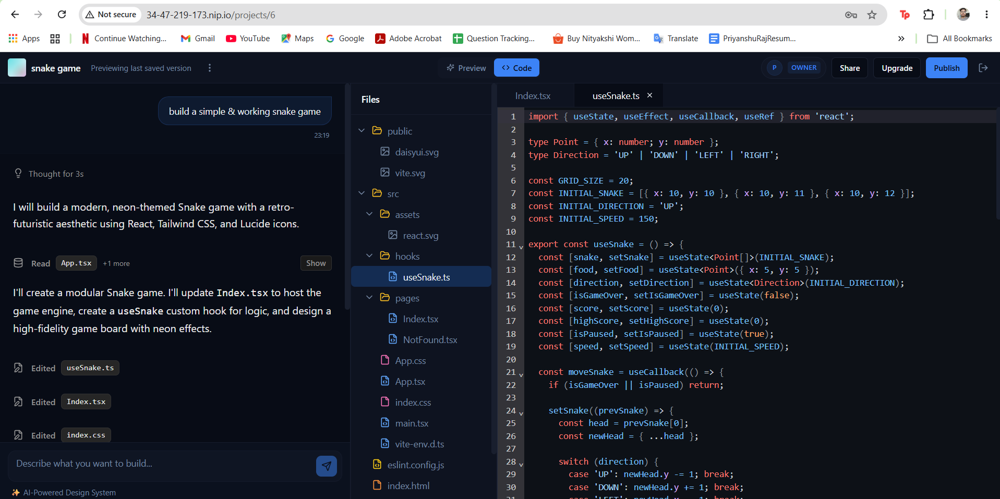
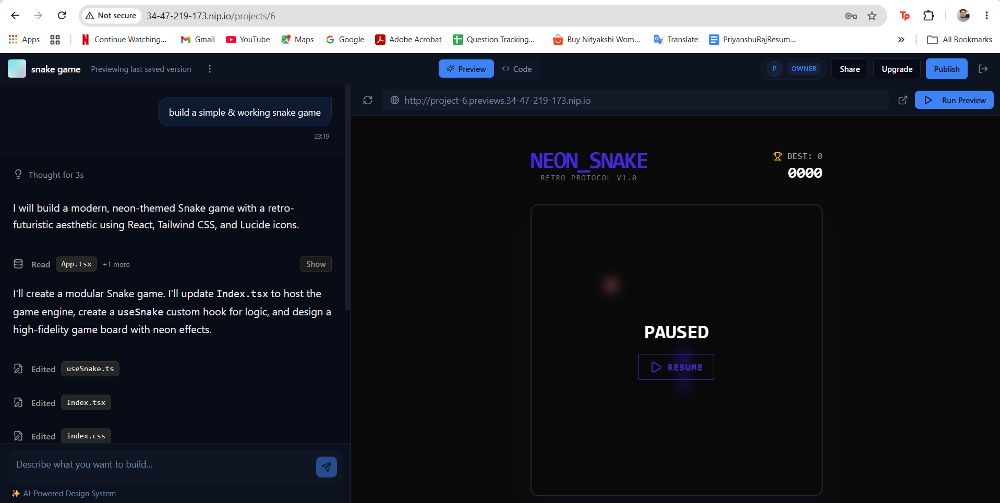
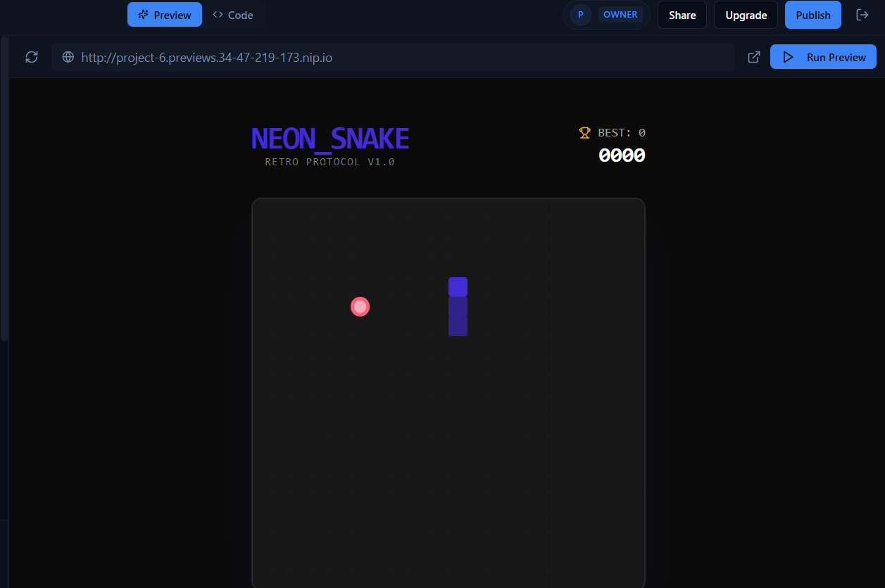
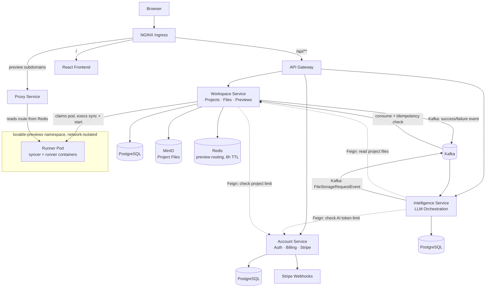

<div align="center">

# ⚡ Forgeboard

**An AI SaaS platform where you type a prompt like _"build a snake game"_ — and get a real, running app back, with a live preview, in seconds.**

Built the way Lovable / bolt.new work — but built by me, from the LLM orchestration down to the Kubernetes pod that runs your generated app.

[](.)
[](.)
[](.)
[](.)
[](.)
[](.)
[](.)

</div>

---

## Why I built this

I wanted to understand how a product like Lovable or bolt.new actually works under the hood — not just "call an LLM API and stream the response," but the harder, less talked-about parts: how do you save AI-generated files reliably when the AI service and the storage service are two completely different processes? How do you let a stranger's AI-generated code run somewhere without it becoming a security hole? How do you avoid a 10-second cold start every time someone wants to preview their app?

So I built it **twice**. First as a monolith, just to prove the product idea worked end to end. Then I tore it apart and rebuilt it as six independent microservices — specifically so I'd be forced to solve the problems that only show up in a distributed system: eventual consistency, idempotent messaging, service-to-service auth, and multi-tenant container orchestration on real infrastructure (GKE), not a toy setup.

This README walks through the two flows I think are actually worth talking about in an interview — **saving AI-generated files reliably**, and **spinning up an isolated live preview in seconds** — because that's where most of the real engineering in this project lives.

<br>

<p align="center">
  
  <br><em>The AI explains its plan, edits files live, and the result deploys straight into a live preview pane.</em>
</p>

---

## What it looks like

<table>
<tr>
<td width="50%" align="center">
<br/>
<sub><b>Sign up</b> — JWT issued by Account Service</sub>
</td>
<td width="50%" align="center">
<br/>
<sub><b>Project dashboard</b> — every prompt becomes a saved project</sub>
</td>
</tr>
<tr>
<td width="50%" align="center">
<br/>
<sub><b>Generated code</b> — real files, fully browsable</sub>
</td>
<td width="50%" align="center">
<br/>
<sub><b>Live sandbox</b> — the app, running in its own pod</sub>
</td>
</tr>
</table>

<p align="center">
  
  <br><sub>The finished result — a playable Snake game, generated end-to-end from one sentence</sub>
</p>

---

## Tech stack

**Frontend:** React, TypeScript, Vite, Tailwind, CodeMirror for the in-browser editor.

**Backend:** Java, Spring Boot, Spring AI, PostgreSQL, MinIO for file storage, Stripe for billing and subscriptions, Kafka for async messaging, Redis for preview routing, Docker + Kubernetes for deployment and the live-preview sandbox.

---

## Architecture

I have six microservices, plus a shared library every service depends on:

- **API Gateway** — the single public entry point. Routes requests to the right downstream service and validates the JWT at the edge.
- **Config Service** — centralized configuration, so I can change a value without restarting every service.
- **Account Service** — auth, billing, and subscriptions. Subscription state is driven directly by Stripe webhook events, not by trusting whatever the client tells me.
- **Intelligence Service** — talks to the LLM, generates code, streams the response back to the user.
- **Workspace Service** — owns project/project-member data, file storage in MinIO, and the whole live-preview deployment lifecycle.
- **Discovery Service** — Eureka, used locally for dev. In the actual production cluster, I drop this entirely and let Kubernetes' own DNS handle service-to-service resolution instead.
- **common-lib** — shared code every service pulls in: a `JwtAuthFilter` so every service validates auth the exact same way, and a `GlobalExceptionHandler` so every service returns errors in the exact same shape. Otherwise I'd be duplicating (and slowly de-syncing) that logic six times.

Services talk to each other two ways: **Feign** for synchronous, "I need an answer now" calls (like "does this user still have project slots left?"), and **Kafka** for anything that shouldn't block the caller and needs to survive a service being briefly down.



---

## The part I actually want to talk about #1: how one prompt becomes a whole application

This is honestly the part I find most interesting to explain, because it's not "call the LLM and stream back whatever it says." Raw LLM output is just words — turning that into real, saveable, individually-trackable files meant I had to design an actual protocol for the model to follow, not just write a clever prompt.

I made the model speak in a strict format, using three tags — `<tool>` to request file reads, `<message>` to talk to the user, and `<file path="...">` to output a complete file — and I make it follow the same sequence every single time: **Analyze** first, meaning read whatever files it actually needs before touching anything. **Plan** second, meaning tell me in one message exactly which files it's about to create or modify. **Execute** third, meaning emit those files, one `<file>` tag per path. Then **Stop** — print one short final message and it's done. There's also a rule I added the hard way: a file path can only be emitted once per response. No "let me also tweak that" halfway through, because that's exactly what led to the model second-guessing itself and streaming out a corrupted second version of a file it had just finished writing.

I also didn't want to dump the whole codebase into every single prompt. So I gave the model a real tool it can call — `read_files`, defined with Spring AI's `@Tool` annotation and a `@ToolParam` that takes a list of relative paths, like `["src/App.tsx", "src/hooks/useSnake.ts"]`. When the model calls it, that list goes out through `WorkspaceClient` — a Feign client — as one `getFileContent` call per path against Workspace Service, and each result comes back wrapped as `--- START OF FILE: path ---` / content / `--- END OF FILE ---` so the model can cleanly tell where one file ends and the next begins inside its own context. The tool's description also explicitly restricts it to paths that exist in the injected `FILE_TREE` — so the model isn't just free to ask for anything, only what it's already been told is actually there. The model decides for itself which of those files it needs before editing, instead of me shipping every file in the project on every message. That's not just a nice-to-have — a prompt that ships the entire project's source on every single turn scales token cost and latency linearly with project size, and it'll blow the context window outright once a project has 30–40 files in it. Letting the model pull only what it needs keeps every generation's cost roughly constant regardless of how big the project has grown.

The worst bug I hit building this whole service was the tool-call loop just not terminating. Sometimes a request would completely hang — the stream would stay open, nothing would ever finish, and the user would just sit there staring at a spinner. What was actually happening was that the model had no hard boundary telling it when to stop calling `read_files` and just commit to an answer. It would sometimes ask for a file it already had, or ask for a path that didn't exist in the project at all — basically hallucinate a file — and because nothing forced it out of that reading phase, it could keep issuing tool calls indefinitely instead of ever reaching the plan/execute/stop part of the flow. This wasn't something I could fix with a try-catch, because the loop was happening inside the model's own reasoning, one call at a time, and every individual call looked "valid" on its own. The actual fix was tightening the contract, not the code — I locked `read_files` down so it only accepts paths that actually exist in the file tree I inject, added a rule that a file already read can never be re-requested in the same turn, and made **Stop** an explicit, numbered, non-optional step instead of leaving termination as something the model was implicitly supposed to figure out on its own.

I also don't make the model guess what already exists in a project. I built a `FileTreeContextAdvisor` that hooks into Spring AI's advisor chain and, on every single request, quietly injects the project's current file tree as an extra system message before my prompt even reaches the model. So if I ask it to add a dark mode toggle, it already knows there's a `Header.tsx` and a `useTheme` hook sitting there — it's not guessing, and it's not going to stomp on something it doesn't know about.

Once the model finishes, I still have to turn that streamed text into something I can actually store and act on, because LLM output isn't JSON — it's just tagged text. So I regex-parse the full response against those same `<message>`, `<file>`, and `<tool>` tags and turn it into a list of `ChatEvent` rows — `MESSAGE`, `FILE_EDIT`, `TOOL_LOG` — each with its own status. That's what lets the UI show something like "editing `useSnake.ts`" as its own line, and it's also exactly what feeds into the saga I explain below — every `FILE_EDIT` event becomes one Kafka message, not one giant blob of text I'd have to somehow split apart after the fact.

And the system prompt isn't just "write code" — it has an actual design opinion baked into it. I explicitly told the model to avoid the generic "AI slop" look — no default Inter font, no purple gradient on white, no cookie-cutter layouts — and pushed it toward semantic Tailwind classes, real typography choices, and actual motion. It's a small thing, but it's the difference between something that looks like every other AI demo and something that looks like it was actually designed.

---

## The part I actually want to talk about #2: saving AI-generated files without losing or duplicating them

This is the flow I'm proudest of, because it's the one that forced me to actually think about distributed systems correctly instead of just wiring services together and hoping.

The problem: Intelligence Service generates a file. Workspace Service is the one that actually owns file storage. They're two separate processes with two separate databases — I can't just wrap both operations in one transaction.

So I used a **choreography-based saga** over Kafka:

1. Intelligence Service generates a file and publishes a `FileStorageRequestEvent` to Kafka, tagged with a unique **saga ID**.
2. Workspace Service consumes that event. But before it saves anything, it checks a `ProcessedEvent` table for that saga ID.
3. This check exists because Kafka only guarantees **at-least-once delivery** — the same event can legitimately be redelivered (consumer restarts, rebalances, network blips, whatever). If I don't check, the same file could get "saved" twice, or worse, saved with a stale duplicate write clobbering a newer one.
4. If the saga ID has already been processed, Workspace Service doesn't touch storage again — it just re-sends the same acknowledgment. **Idempotent by construction, not by luck.**
5. If it's new, it saves the file to MinIO, records the saga ID as processed, and publishes a result event — success or failure — back to Kafka.
6. Intelligence Service picks that up and updates the chat event the user is looking at, so the UI reflects **what actually happened**, not what the system optimistically assumed happened the moment it published the request.

That last point mattered a lot to me — it would've been easy to just show "File saved ✓" the instant the event was published and call it done. But that's lying to the user if the write later fails. Closing the loop with a real response event was the only way to keep both services' data actually consistent with each other.

---

## The part I actually want to talk about #3: live preview, without a cold start every time

The other piece I spent real time on is how "Show Preview" goes from a click to a running app in a couple of seconds instead of thirty.

**The trick is a pre-warmed pod pool.** I keep a set of idle pods sitting ready in a dedicated Kubernetes namespace (`lovable-previews`), completely separate from the rest of the platform. Each pod has **two containers sharing one volume**:
- a **syncer** container, whose job is pulling files from MinIO into the shared volume
- a **runner** container, which actually runs the generated app (`npm install && npm run dev`)

Here's what happens when a user clicks "Show Preview":

1. The request hits **Workspace Service**. First it checks: is there already a running, busy pod labeled for this project? If yes — just return that preview URL, done, nothing else needs to happen.
2. If not, it claims one **idle** pod from the pool and flips its label from `idle` to `busy` for this project.
3. Using **Fabric8** (the Kubernetes Java client), it execs straight into the pod: the syncer wipes `/app` and mirrors the project's latest files down from MinIO, then kicks off a background watcher so any *future* file edits sync into the running pod live, without a redeploy.
4. Then it execs into the runner container and starts `npm install && npm run dev`.
5. **Only once the pod is confirmed actually running** does Workspace Service write the mapping into Redis — `route:project-<id>.previews.domain.com → podIP:5173` — with a **6-hour TTL**. I don't register the route earlier, because a route pointing at a pod that isn't ready yet is worse than no route at all.

The second half of this is what happens when someone hits the preview URL directly, in a new tab, later — and this request **never touches Workspace Service at all**. It goes straight to a lightweight **Node.js proxy service**, which looks up `route:<hostname>` in Redis and either forwards the request/WebSocket connection to that pod, or returns a clean "not found or expired" response if the TTL's run out. Keeping this path completely separate from the deploy path means viewing a preview never puts load on the same service that's orchestrating pod lifecycles.

And because these pods live in their own namespace with a `NetworkPolicy` locking down ingress/egress, the AI-generated code running inside one can't reach the platform's databases, Kafka, or any other user's pod — even though it's arbitrary, untrusted, LLM-written code.

---

## Repository structure

```
distributed-lovable/
│
├── Lovable Frontend/project-companion/   # React + TypeScript SPA
│   └── src/
│       ├── components/                   # UI components (incl. shadcn/ui primitives)
│       ├── hooks/                        # Custom React hooks
│       ├── lib/                          # API clients, utilities
│       └── pages/                        # Route-level views (dashboard, editor, chat)
│
├── common-lib/                           # Shared across every backend service
│   └── src/main/java/.../common_lib/
│       ├── security/                     # JwtAuthFilter, AuthUtil, JwtUserPrincipal
│       ├── error/                        # GlobalExceptionHandler, ApiError, custom exceptions
│       ├── event/                        # Kafka event contracts (FileStoreRequestEvent, etc.)
│       ├── dto/                          # Shared DTOs so JPA entities never cross service boundaries
│       └── enums/                        # Shared enums (ProjectRole, ChatEventType, etc.)
│
├── api-gateway/                          # Spring Cloud Gateway — routing + edge JWT validation
├── config-service/                       # Spring Cloud Config Server
├── discovery-service/                    # Eureka (local dev only)
│
├── account-service/                      # Auth, billing, Stripe webhooks
│   └── src/main/java/.../account_service/
│       ├── controller/                   # AuthController, BillingController, InternalAccountController
│       ├── service/  entity/  repository/  mapper/  security/  config/
│
├── workspace-service/                    # Projects, files, live preview orchestration
│   └── src/main/java/.../workspace_service/
│       ├── controller/                   # ProjectController, FileController, ProjectMemberController
│       ├── consumer/                     # FileStorageConsumer (the idempotent saga consumer)
│       ├── service/impl/                 # KubernetesDeploymentServiceImpl (the preview pod logic)
│       ├── client/                       # Feign client → Account Service
│       ├── security/                     # @PreAuthorize ownership checks
│       └── entity/  repository/  mapper/  dto/  config/
│
├── intelligence-service/                 # LLM orchestration
│   └── src/main/java/.../intelligence_service/
│       ├── controller/                   # ChatController (SSE streaming endpoint)
│       ├── llm/                          # CodeGenerationTools, FileTreeContextAdvisor, LlmResponseParser
│       ├── consumer/                     # IntelligenceSagaResponseHandler
│       ├── client/                       # Feign clients → Workspace + Account
│       └── service/impl/  entity/  repository/  mapper/
│
└── k8s/
    ├── infra/                            # Namespaces, Ingress, NetworkPolicies, runner pod pool
    ├── stateful/                         # Kafka, PostgreSQL, Redis, MinIO manifests
    ├── services/                         # Deployments + Services for every microservice
    └── proxy/                            # The Node.js preview-routing proxy
```

---

## Running it locally

```bash
# common-lib first — every service depends on it
cd common-lib && ./mvnw clean install -DskipTests

# infra: Kafka, PostgreSQL, Redis, MinIO — see k8s/stateful/ for reference config

# platform services
cd discovery-service && ./mvnw spring-boot:run &
cd config-service && ./mvnw spring-boot:run &
cd api-gateway && ./mvnw spring-boot:run &
cd account-service && ./mvnw spring-boot:run &
cd workspace-service && ./mvnw spring-boot:run &
cd intelligence-service && ./mvnw spring-boot:run &

# frontend
cd "Lovable Frontend/project-companion" && npm install && npm run dev
```

For a full Kubernetes deployment, apply manifests in order — `k8s/infra/` → `k8s/stateful/` → `k8s/services/` → `k8s/proxy/`.

**CI/CD:** every push to `master` that touches a service's folder builds and pushes a Docker image for just that service via **Jib**, authenticates to GCP with **no stored keys at all** (GitHub OIDC exchanged for short-lived credentials via Workload Identity Federation), and rolls it out with `kubectl set image` — waiting on the rollout to confirm zero downtime before finishing.

---

<div align="center">
<sub>Built by Priyanshu Raj</sub>
</div>
